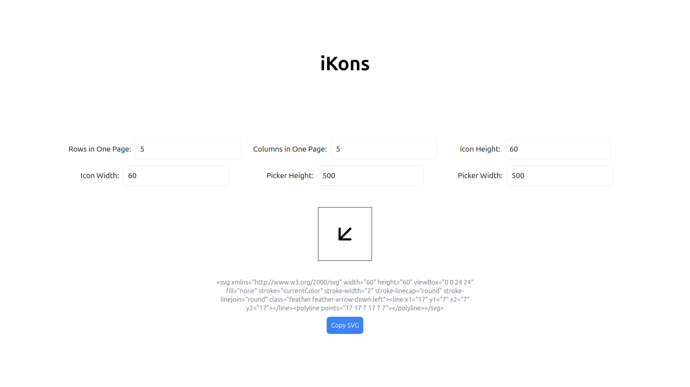
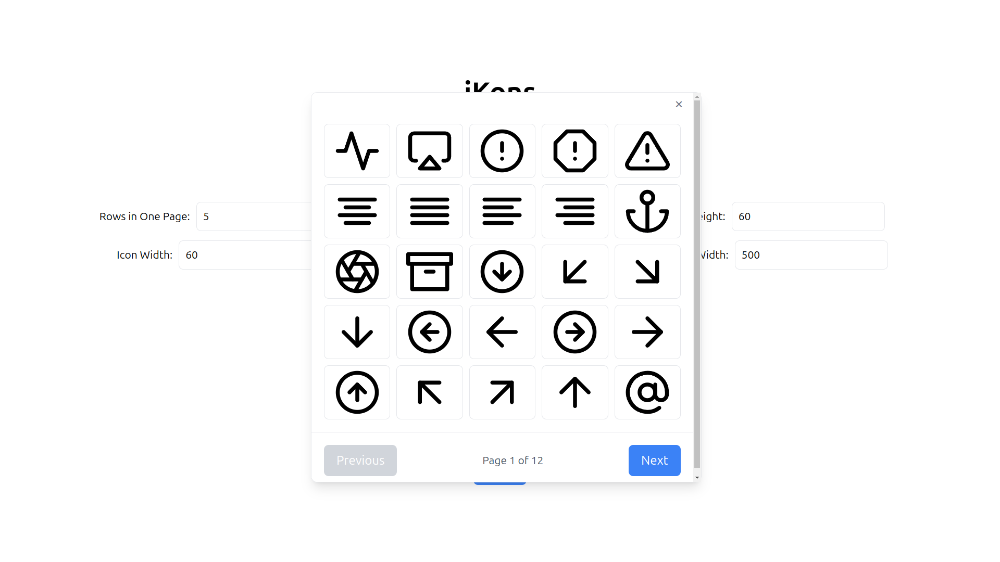

# Icon Picker

A simple and customizable icon picker built with React and styled using Tailwind CSS. This application allows users to select an icon from the Feather Icons library, view its corresponding SVG markup, and easily copy it to use in their projects.
Features

- Browse and pick icons from the Feather Icons library.
- Display the raw SVG code of the selected icon.
- Easily copy the SVG code for use in projects.
- Fully responsive layout built with Tailwind CSS.
- Lightweight and fast, using feather-icons for SVGs.
- Customize picker and icon heights

## Screenshots

